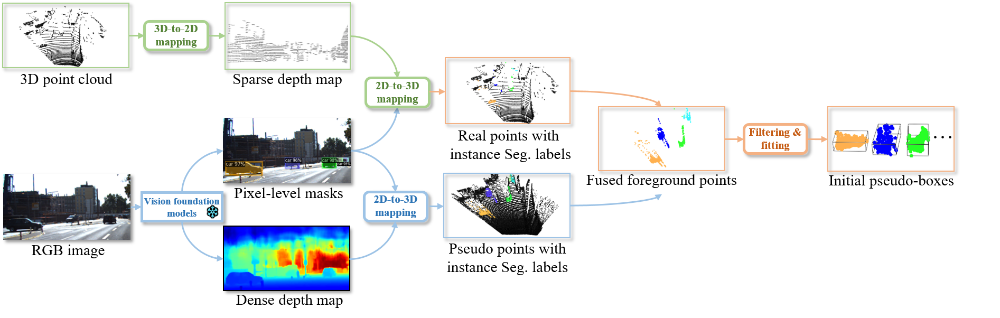

# Enhancing Pseudo-Boxes via Data-Level LiDAR-Camera Fusion for Unsupervised 3D Object Detection

<div align="center">

[Mingqian Ji](https://github.com/Mingqj) </sup>,
[Shanshan Zhang](https://shanshanzhang.github.io/) ✉</sup>,
[Jian Yang](https://scholar.google.com/citations?user=6CIDtZQAAAAJ&hl=zh-CN) </sup>

PCA Lab, School of Computer Science and Engineering, Nanjing University of Science and Technology

✉ Corresponding author

[](https://arxiv.org/abs/2508.20530)
[](https://www.apache.org/licenses/LICENSE-2.0)

</div>

## 📖 About

This repository represents the official implementation of the paper titled "Enhancing Pseudo-Boxes via Data-Level LiDAR-Camera Fusion for Unsupervised 3D Object Detection".

We propose a novel unsupervised 3D object detection framework built on early-stage data-level fusion of LiDAR and RGB images. Specifically, we design a bi-directional fusion module, where LiDAR points inherit semantic category labels from 2D instance segmentation, while image pixels are projected into 3D to densify sparse point clouds. To address errors from depth estimation and segmentation, we introduce a noise suppression module that applies local radius filtering to reduce depth noise and global statistical filtering to remove outliers. Finally, a dynamic self-evolution module iteratively refines pseudo-boxes under dense representations, leading to more accurate and reliable detection results.



## 💾 Main Results 

**nuScenes val set**
| Methods     | Label  | Vehicle | Pedestrian | Cyclist|   All    |
|:------------:|:----:|:----:|:---:|:---:|:---:|
| Supervised  | 1% | 39.3 | 31.8| 1.8 | 14.3|
| DFU3D  | 0 | 32.3 | 37.7| 15.3 | 28.4|

Notice: We adopt CenterPoint as the base detector. The results are AP.

**KITTI set**
| Methods    | Label | Easy | Mod. | Hard |
|:------------:|:----:|:----:|:---:|:---:|
|Supervised|    100%   | 97.1 | 89.2 | 81.8|
|DFU3D|    0   | 95.1 | 97.3 | 81.0|

Notice: We adopt CenterPoint as the base detector. The results are AP$_{3D}$ @ IoU$_{0.5}$.

## Get Started

#### 🛠️ Installation and Data Preparation

1. Please refer to [OpenPCDet](https://github.com/open-mmlab/OpenPCDet), [SEEM](https://github.com/UX-Decoder/Segment-Everything-Everywhere-All-At-Once), and [DepthAnything](https://github.com/LiheYoung/Depth-Anything) to install the environments.
2. Prepare nuScenes dataset.
3. Transfer nuScenes format to KITTI format by running:
```shell
python DFU3D/tool/nuscenes2kitti.py nuscenes_gt_to_kitti --dataroot ./data/nuscenes/
```
4. Follow OpenPCDet to create pkl files.

Notice: arrange the folder as:
```shell script
OcRFDet
    └──data
        └── nuscenes
            ├── v1.0-trainval
            ├── sweeps 
            └── samples
        └── nuscenes_kitti_format
            ├── train_28130
            ├── val_6019
            ├── nuscenes2kitti_infos_train_28130.pkl
            └── nuscenes2kitti_infos_val_6019.pkl
```

5. Download the vision-foundation models from [SEEM](https://github.com/UX-Decoder/Segment-Everything-Everywhere-All-At-Once) and [DepthAnything](https://github.com/LiheYoung/Depth-Anything) to file ./tools/PENet/XDecoder/weights/ and ./tools/PENet/Depth_Anything/weights/.
   

#### 🏋️ Obtain the pseudo-boxes
```shell
cd DFU3D/tools/PENet/
CUDA_VISIBLE_DEVICES=0 python3 main.py --command evaluate --detpath ../../data/nuscenes_kitti_format/train_28130 --conf_files X_Decoder/configs/xdecoder/segvlp_focalt_lang.yaml --overrides WEIGHT ./tools/PENet/XDecoder/weights/xdecoder_focalt_best_openseg.pt --pretrained_resource ./tools/PENet/Depth_Anything/weights/depth_anything_metric_depth_outdoor.pt
```

#### 📋 Trian the base model
```shell
cd DFU3D/tools/
bash scripts/dist_train.sh 8 --cfg_file cfgs/kitti_models/centerpoint.yaml
```

#### 📋 Test the base model
```shell
bash scripts/dist_test.sh 8 --cfg_file cfgs/kitti_models/centerpoint.yaml --ckpt kitti_models/centerpoint/default/checkpoint.pth
```


## ❛❛❞ Citation
```bibtex
@article{ji2025dfu3d,
  title={Enhancing Pseudo-Boxes via Data-Level LiDAR-Camera Fusion for Unsupervised 3D Object Detection},
  author={Ji, Mingqian and Yang, Jian and Zhang, Shanshan},
  journal={arXiv preprint arXiv:2508.20530},
  year={2025}
}
```

## ❤️ Acknowledgement

We thank these great works and open-source codebases: [OpenPCDet](https://github.com/open-mmlab/OpenPCDet), [SEEM](https://github.com/UX-Decoder/Segment-Everything-Everywhere-All-At-Once), [DepthAnything](https://github.com/LiheYoung/Depth-Anything), and [PENet](https://github.com/JUGGHM/PENet_ICRA2021).
